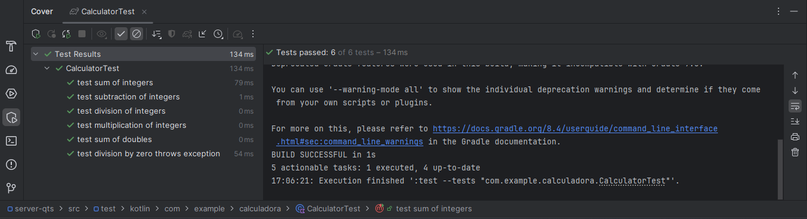
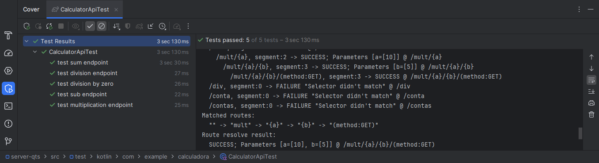

# AT2 | Testes unitários e de integração

Classe `Calculator`:

```kotlin
package com.example.calculadora

data class Calculator(
    val n1: Number,
    val n2: Number
)

fun Calculator.sum(): Number{
    return if (n1 is Int && n2 is Int) {
        n1.toInt() + n2.toInt()
    } else {
        n1.toDouble() + n2.toDouble()
    }
}

fun Calculator.sub(): Number{
    return if (n1 is Int && n2 is Int) {
        n1.toInt() - n2.toInt()
    } else {
        n1.toDouble() - n2.toDouble()
    }
}

fun Calculator.multiply(): Number{
    return if (n1 is Int && n2 is Int) {
        n1.toInt() * n2.toInt()
    } else {
        n1.toDouble() * n2.toDouble()
    }
}

fun Calculator.divide(): Number{
    require(n2.toDouble() != 0.0) { "Divisão por zero não é permitida!" }

    return if (n1 is Int && n2 is Int) {
        n1.toInt() / n2.toInt()
    } else {
        n1.toDouble() / n2.toDouble()
    }
}
```

Classe `CalculatorAPI`:

```kotlin
package com.example.calculadora

import io.ktor.server.application.Application
import io.ktor.server.application.call
import io.ktor.server.response.respondText
import io.ktor.server.routing.get
import io.ktor.server.routing.routing
import kotlin.text.toDoubleOrNull

fun Application.CalculatorAPI() {
    routing {
        get("/") {
            call.respondText("Hello World!")
        }

        get("/sum/{a}/{b}") {
            val a = call.parameters["a"]?.toDoubleOrNull() ?: 0.0
            val b = call.parameters["b"]?.toDoubleOrNull() ?: 0.0

            call.respondText(Calculator(a, b).sum().toString())
        }

        get("/sub/{a}/{b}") {
            val a = call.parameters["a"]?.toDoubleOrNull() ?: 0.0
            val b = call.parameters["b"]?.toDoubleOrNull() ?: 0.0

            call.respondText(Calculator(a, b).sub().toString())
        }

        get("/mult/{a}/{b}") {
            val a = call.parameters["a"]?.toDoubleOrNull() ?: 0.0
            val b = call.parameters["b"]?.toDoubleOrNull() ?: 0.0

            call.respondText(Calculator(a, b).multiply().toString())
        }

        get("/div/{a}/{b}") {
            val a = call.parameters["a"]?.toDoubleOrNull() ?: 0.0
            val b = call.parameters["b"]?.toDoubleOrNull() ?: 0.0

            if (b == 0.0)
                call.respondText("Divisão por zero não é permitida!")
            else
                call.respondText(Calculator(a, b).divide().toString())
        }
    }
}
```

## Testes unitários classe `Calculator`

Classe de testes `CalculatorTest`:

```kotlin
package com.example.calculadora

import kotlin.test.Test
import kotlin.test.assertEquals
import kotlin.test.assertFailsWith

class CalculatorTest {
    @Test
    fun `test sum of integers`() {
        val calc = Calculator(5, 3)
        assertEquals(8, calc.sum())
    }

    @Test
    fun `test sum of doubles`() {
        val calc = Calculator(5.5, 3.2)
        assertEquals(8.7, calc.sum())
    }

    @Test
    fun `test subtraction of integers`() {
        val calc = Calculator(10, 4)
        assertEquals(6, calc.sub())
    }

    @Test
    fun `test multiplication of integers`() {
        val calc = Calculator(3, 4)
        assertEquals(12, calc.multiply())
    }

    @Test
    fun `test division of integers`() {
        val calc = Calculator(10, 2)
        assertEquals(5, calc.divide())
    }

    @Test
    fun `test division by zero throws exception`() {
        val calc = Calculator(10, 0)
        val exception = assertFailsWith<IllegalArgumentException> {
            calc.divide()
        }
        assertEquals("Divisão por zero não é permitida!", exception.message)
    }
}
```

Resultado dos testes:



## Testes de integração classe `CalculatorAPI`

Classe de testes `CalculatorAPITest`:

```kotlin
package com.example.calculadora

import io.ktor.client.request.get
import io.ktor.client.statement.bodyAsText
import io.ktor.http.HttpStatusCode
import io.ktor.server.testing.testApplication
import kotlin.test.Test
import kotlin.test.assertEquals

class CalculatorApiTest {
    @Test
    fun `test sum endpoint`() = testApplication {
        application { CalculatorAPI() }

        client.get("/sum/10/5").apply {
            assertEquals(HttpStatusCode.OK, status)
            assertEquals("15.0", bodyAsText())
        }
    }

    @Test
    fun `test sub endpoint`() = testApplication {
        application { CalculatorAPI() }

        client.get("/sub/10/5").apply {
            assertEquals(HttpStatusCode.OK, status)
            assertEquals("5.0", bodyAsText())
        }
    }

    @Test
    fun `test multiplication endpoint`() = testApplication {
        application { CalculatorAPI() }

        client.get("/mult/10/5").apply {
            assertEquals(HttpStatusCode.OK, status)
            assertEquals("50.0", bodyAsText())
        }
    }

    @Test
    fun `test division endpoint`() = testApplication {
        application { CalculatorAPI() }

        client.get("/div/10/2").apply {
            assertEquals(HttpStatusCode.OK, status)
            assertEquals("5.0", bodyAsText())
        }
    }

    @Test
    fun `test division by zero`() = testApplication {
        application { CalculatorAPI() }

        client.get("/div/10/0").apply {
            assertEquals(HttpStatusCode.OK, status)
            assertEquals("Divisão por zero não é permitida!", bodyAsText())
        }
    }
}
```

Resultado dos testes:

